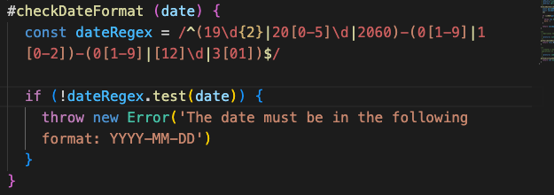
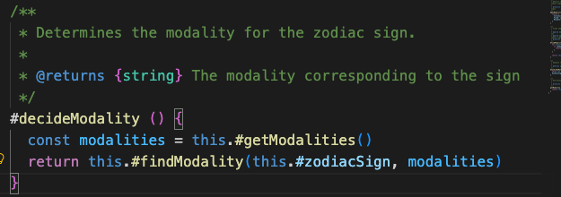
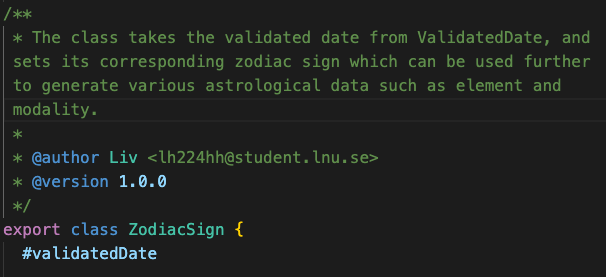
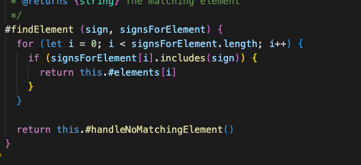
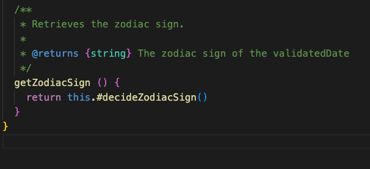
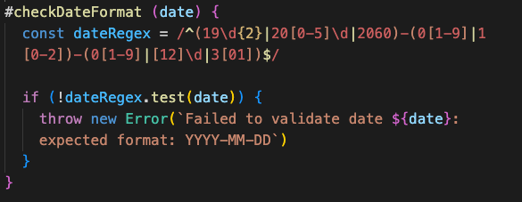
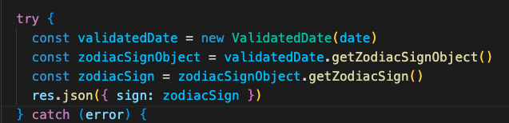
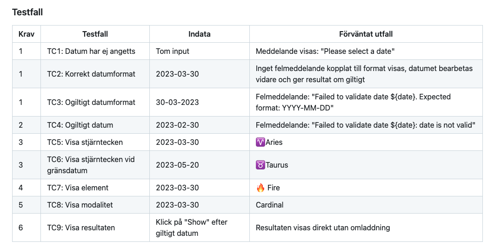
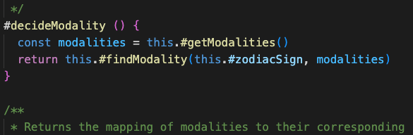
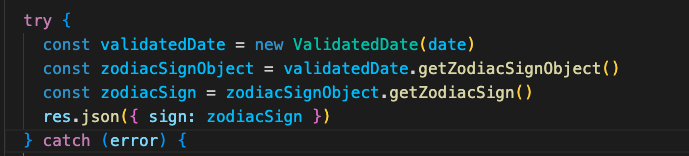

# L3 – Astrology App

Reflektioner utifrån Clean Code kap. 2–11 för L3 - appen.  

### Kapitel 2 - Namngivning

Namn bör enligt Clean Code bl. a vara självförklarande, lätta att uttala, och sökbara. Detta minskar missförstånd och behovet av att kommentera, gör att man lättare kan diskutera kring klassen/metoden/variabeln och även att sökfunktionen enkelt kan användas för att hitta det man söker för vidare åtgärd. Därför har jag exempelvis förtydligat variabelnamn i den här uppdaterade koden, vilket blir till fördel för både diskussioner, tydlighet och sökningar. re blev t. ex. till dateRegex, och DateManager blev till ValidatedDate. Det finns konventioner om att klasser och objekt bör vara substantiv eller substantivfraser medan metoder bör vara verb eller verbfraser eftersom de gör något, så detta är också mer i linje med det. Överlag tar jag med mig vikten av att vara tydlig i sin namngivning, det kommer att hjälpa både mig och andra som ska läsa koden.  

Här är ett exempel på förtydligat variabelnamn:  

### Kapitel 3 - Funktioner

Funktioner bör bl. a. vara små och endast göra en sak. I min tidigare implementation fanns metoder som var långa och gjorde flera saker som att både definiera data, loopa igenom den och returnera resultat, vilket gjorde de svårare att läsa och förstå. Jag har nu refaktorerat och delat upp flera av mina metoder för att förbättra koden och följa dessa typer av rekommendationer. Och nu känns koden mer clean.  

Exempel på refaktorerad metod som nu är liten (4 rader) och bara gör en sak:  

### Kapitel 4 - Kommentarer

Kommentarer ska vara ett komplement, och ska inte ersätta dålig kod. Så långt som möjligt bör koden vara tydlig och självförklarande, men vissa kommentarer är nödvändiga, t ex kräver ESLint JSDoc. Mina tydliga och förbättrade namnval hjälper till här. Jag brukar ofta skriva några inlinekommentarer, men det har jag inte nu, den förbättrade koden hjälper till ändå. De kommentarer man har bör förklara intentionen med koden, inte upprepa vad koden gör.  

Exempel på en intentionshjälpande kommentar som ger kontext:  

### Kapitel 5 - Formatering

Vår kod bör vara snyggt formaterad eftersom det underlättar översikt och läsbarhet för både oss själva och andra utvecklare. Jag brukar använda Prettier som hjälper till med automatisk formatering så att det blir snyggt och enhetligt, och det gör jag även här. Därtill bör relaterade funktioner ligga i en logisk ordning nära varandra.  

Exempel på snygg formatering:  

### Kapitel 6 - Objekt och datastrukturer

Objekt bör dölja sin data, och istället exponera metoder som arbetar med datan. Ingen annan behöver veta hur implementationen fungerar internt. I min kod har jag eftersträvat privata variabler för att förhindra direkt åtkomst och manipulation från andra delar av koden. Istället finns metoder för att hämta resultatet, och intern logik hanteras av privata hjälpmetoder i klasserna. På detta sätt blir koden lättare att underhålla.  

Exempel på abstraktion utan att avslöja intern implementation:  

### Kapitel 7 - Felhantering

Felhantering är nödvändig för att hålla koden robust, men ska inte överanvändas så att koden blir otydlig. Man bör använda exceptions för att hantera sina fel, vilket jag gjort, och ge information om vilken operation som misslyckades och varför. Jag har förtydligat mina felmeddelanden enligt detta så att det nu blivit ännu tydligare. Jag undviker också att returnera null eller felkoder, då det kan leda till ytterligare problem i körningen.  

Exempel på kod med sådan felhantering:  

### Kapitel 8 - Gränser

Det är bra att hålla sin kod tydligt avgränsad mot andras kod, som tredjepartsbibliotek och liknande. Det kan göras med t ex en adapter eller ett repositorylager, något som ligger emellan och fungerar som ett mellanlager. Fördelen med detta är att koden inte behöver blandas ihop och kompliceras. Den ena behöver inte veta så mycket om hur den andra fungerar, och om man behöver uppdatera kan det göras enkelt på bara ett ställe utan att allt förstörs och påverkar resten av systemet. Här i min applikation fungerar min modul som en extern del, och appen behöver inte och ska inte veta så mycket om den, men kunna använda den.  

Exempel på gränssättning där min app använder de publika metoderna på modulen, utan att veta något om den:  

### Kapitel 9 - Enhetstestning

Tester bör vara enkla, rena och fokuserade på en sak i taget. Jag har testat min applikation manuellt i webbläsaren utefter väl avgränsade och tydliga testfall kopplade till kraven. Testerna ska vara uppdaterade i enlighet med koden, det håller de relevanta och tydliga. Mina tester är uppdaterade i enlighet med min kod och följer principen om ett koncept per test.  

Exempel på mina testfall där jag är tydlig såväl vad gäller det visuella samt innehållet i testfallen och dess koppling till specifika krav:  

### Kapitel 10 - Klasser

Klasser bör vara små och ha ett enda ansvar (SRP). Ansvaret inom dem bör också hänga ihop. Mina klasser är små och hanterar bara en sak, till exempel att ta fram element för ett stjärntecken. Klassen Element är väldigt cohesive, allt inom den hänger logiskt ihop. Jag har max 1–2 instansvariabler. Att ha många instansvariabler gör naturligt nog att klassen blir större och riskerar bli spretigare och rörigare.  

Exempel som visar hur klassen arbetar med sitt ansvar för att bestämma modalitet genom interna metoder och data:  

### Kapitel 11 - System

System bör byggas modulärt så de inte blir för komplexa. Kod som bygger (skapar objekt), t ex i main, bör separeras från kod som använder objekten. I min applikation skapas objekten i den yttre delen av systemet, där flödet startar i index.js och skapar det första objektet ValidatedDate. Att använda Dependency Injection, så att klassen inte skapar sina egna beroenden vilket ger mindre kopplingar, är en viktig grundprincip. Detta kunde jag ha förbättrat ytterligare då ValidatedDate nu skapar ZodiacSign. I övrigt tycker jag min kod följer dessa principer ganska väl.  

Exempel från det yttersta lagret index.js som är min main, där  ValidatedDate skapas innan det används vidare längre in i applikationen:  

# L2 – Astrology Module

Reflektioner utifrån Clean Code kap. 2–3 för L2 - modulen.  

## Allmänna reflektioner

I arbetet med den här uppgiften och med genomgång av de två kapitlen har jag fått med mig bra riktlinjer att tänka på när jag skriver kod. Jag har kunnat jämföra min kod med det jag läser, och identifiera såväl områden och fall där jag väl följer rekommendationerna, något att ta fasta på, samt områden där jag brister och behöver tänka på att försöka applicera mer framöver. Att sträva efter Single Responsibility Principle (SRP) känner jag t ex att jag kan utvecklas mer kring.   

Jag har sett, både i denna uppgift, och i tidigare jag gjort, att jag kan bli bättre på att applicera DRY-principen. I någon metod har jag nog använt lite väl många nästlade strukturer som bör kunna förenklas/delas upp.   

Jag kan verkligen se vikten av att få koden och programmen mer abstrakta och hanterbara då det är väldigt komplexa strukturer vi arbetar med. Att förmå göra koden både mer förståbar och mer läsbar, såväl för sig själv och andra utvecklare, samt även för automatiserade aktörer ger mycket tillbaka till alla inblandade. Att dela upp sin kod i mindre komponenter är en del i detta. Många av reglerna i boken tycker jag går in i varandra, och är rätt logiska, men det är bra att få läsa om och reflektera kring det, det gör det både tydligare och mer nära till hands.   

Att tänka på att hålla sig konsekvent, tydlig och väl avgränsad är några av medskicken jag tar med mig. Jag ser fram emot att nu kunna börja utvecklas och hitta mina sätt att skriva bra och ren kod.   

### Kapitel 2 - Namngivning

|   Namn och förklaring        |  Reflektion och regler från Clean Code                   |
|------------------------------|----------------------------------------------------------|
| **DateManager** Klassnamn på klassen som först tar hand om inmatat datum. |  **Class Names:** Min tanke med namnet var att det är en klass som ska bearbeta inmatat datum. I boken står att man bör undvika namn som t ex Manager, men det står inte någon förklaring kring det så jag har svårt att veta vad/varför det bör undvikas och kommer därmed nog att ha svårt att komma ihåg det inför framtiden. Kanske menas med detta att jag därför har valt ett "dåligt" namn på min klass, och den borde egentligen heta något annat med datum, kanske DateValidator. Mitt namnval följer annars regeln om att det bör vara ett substantiv. **Use Pronouncable Names:**  Namnet på min klass följer denna regel då det är ett väldigt uttalningsbart namn. Det gör att den aspekten gör det lättare att diskutera klassen med andra i och kring projektet. |
| **zodiacSigns** Ett objekt med alla de 12 stjärntecknen | **Use Intention-Revealing Names:**  Av detta namn kan vi se att det är en samling med hjälp av -s ändelsen. Samlingen innehåller alla stjärntecknen vilket bör vara ganska tydligt utifrån namnet. Om den istället skulle heta bara z, eller zs är inget jag och många andra skulle uppskatta. För att skilja på denna har jag också en annan som heter zodiacSign, som representerar ett enda stjärntecken. **Don’t be cute:**  Att mena vad man säger och inte skoja eller ”slanga” till det. Det har jag följt här då mitt namn är rakt, tydligt och utan tvetydigheter. Alla vet vad stjärntecken är. Man skulle t ex ha kunnat välja att namnge det bara signs, vilket skulle öppna upp det mycket mer för tolkningar eller använda något typ av skoj- eller slangord.  |
| **getElement ()** Hämtar elementet för ett stjärntecken | **Pick one Word per Concept:** För att ta fram det som varje klass ansvarar för att göra har jag för alla publika liknande metoder valt att kalla de getX, som detta exempel, på ett enhetligt sätt. Man bör enligt boken inte ha olika typer av namn för liknande metoder i olika klasser, vilket verkar logiskt. Detta ger en tydlighet och gör det enhetligt, förutsägbart och konsekvent. **Avoid Disinformation:**  Metodnamnet lämnar ingen falsk eller vilseledande information utan är tämligen rakt på sak i vad den gör.  | 
| **validatedDate** Det validerade datumet som har gått igenom valideringen och ska användas för att hämta astrologisk data på. | **Use Searchable Names:** Detta exempel, som de flesta (alla?) av mina namnval är mycket sökbart. Det gör att man enkelt kan hitta alla förekomster av namnet om man önskar. Boken nämner också att ett namns längd bör korrellera med dess omfattning. Detta vet jag inte om jag har följt, utan jag har försökt hitta tydliga namn. Är det inte viktigare att det är tydligt och naturligt? Jag förstår dock grundtanken i kontexten de diskuterar, man kan eventuellt kalla något för en bokstavs namn om det är lokalt och i en liten metod. Då kan det ändå vara tillräckligt tydligt, inte annars. **Avoid encodings:**  Förut var det vanligt att använda t ex ungersk notation, något som inte behövs idag och nu bör undvikas då de bara krånglar till det. Jag har inte använt mig av någon sådan kodning. Hade jag gjort det kunde denna ha hetat t ex sValidatedDate.  |
| **#decideModality ()** Intern metod som bestämmer modalitet för stjärntecken | **Method Names:**  Metoden följer regeln om att metodnamn bör bestå av verb. Eftersom metoder gör någonting blir detta naturligt och tydligt. Här är metodens ansvar att bestämma modalitet för de 12 stjärntecknen.  **Avoid Mental Mapping:** Att man bör välja tydliga namn, utan att mottagaren ska behöva mentalt översätta det. Man är tydlig från början. I den här metoden anser jag att det är tydligt att den bestämmer modaliteten. Eventuellt skulle man kunna lägga till ForSign, men då får vi ett enligt mig onödigt långt namn.  |  

Jag tycker att många av "reglerna" i boken handlar om tydlighet, att man ska vara tydlig i sin namngivning. Jag har försökt att vara det, och har under arbetets gång ändrat vissa namn för att de ska bli mer tydliga då jag t ex hade dubletter, det var lite rörigt och då mitt ändamål med modulen förändrades lite under arbetets gång. Brister finns det dock säkerligen fortfarande.   
Det har varit bra att lära sig lite mer om vad som är bra att tänka på, t ex att ha sökbara namn. Det är ett bra tips som jag kommer att ha nytta av framåt. Även att få kännedom om hungarian notation då det kanske är något man kommer att stöta på framöver. Jag har från kapitlet fått med mig bra perspektiv som jag kommer att ha med mig i arbetet framåt. Det har också varit roligt att kunna lyfta blicken lite, från att tidigare panikförsöka bara få saker att fungera till att nu börja tänka och diskutera lite mer kring hur man bör göra saker.

### Kapitel 3 - Funktioner

|  Metodnamn och länk eller kod |  Antal rader | Reflektion                  |
|-------------------------------|--------------|-----------------------------|
| **#decideZodiacSign ()** (ZodiacSign.js) |   36   |  **Small!** Författaren nämner att funktioner oftast inte bör vara mer än 20 rader och gärna kan vara så små som 2-6 rader. Nu är detta min längsta funktion, men den bryter ju mot denna regel, vilket säkert innebär att den skulle kunna delas upp. Den har därmed också fler nivåer av indentering än önskat. Jag har annars flera funktioner som är 4 rader långa. **Don’t repeat yourself** Då min metod, liksom flera andra, är ”för lång”, finns här också upprepningar, vilket sannolikt har ett samband. Upprepningar bör undvikas och därmed bör vi kunna bryta ut delar. Jag har en upprepad kontroll av datumintervallen, en för objekten, och en för arrayen. Detta skulle förmodligen kunna göras på ett mer enhetligt sätt, med en gemensam kontroll istället för två. |
| **validateDate()** (DateManager.js) |    20    |  **Use Descriptive Names** Metoden validerar det inkomna datumet och namnet är därför bra anser jag. Man förstår utav det vad metoden gör. |
| **#decideElement ()** (Element.js)  |    16    |  **Function Arguments** Den här metoden är niladic. Det är enligt boken att föredra att ha så få argument som möjligt. Koden blir mindre komplex, mer lätthanterlig. Den här metoden kan istället använda klassens interna tillstånd för att utföra sin funktion. Jag anser att det bör behållas på detta sätt. |
| **#decideModality ()** (Modality.js) |   14    | **Do One Thing** Min metod kan nog hävdas gör lite mer än en sak, att både definiera och identifiera modaliteterna, men det kan vara svårt att definiera exakt vad som är en sak. Man borde kunna flytta ut själva deklarationen av de olika modalitetsarrayerna vilket skulle göra metoden kortare och mer fokuserad. **Have No Side Effects** Jag kan inte se att den här metoden skapar några sidoeffekter utanför sig själv. Den biten bör därmed bestå då detta är eftersträvansvärt. |
| **constructor (inputDate)** (DateManager.js) |  8  | **Prefer Exceptions to Returning Error Codes** Här kastar jag undantag i form av ett Error-objekt vilket är det föredragna sättet. Det ger en enklare kod och tydligare information om felen som uppstår. Användning av undantag är särskilt bra att använda vid användarinput, vilket är fallet här. Koden körs fint, tills eventuella fel upptäcks. Jag skulle inte vilja förändra denna biten. **Function Arguments** Här tar jag ett argument (monadic). Det är okej att ha lite fler argument i konstruktorn än i andra metoder så detta är bra, och skulle även kunna ta några fler argument vid behov. Dock bör man inte ha alltför många heller där (inte fler än nödvändigt). |  

Jag kan definitivt se brister i min kod. Allmänt sett kan jag se att jag nog har för långa metoder, vilket hänger ihop med att de gör för mycket, upprepar sig och kan delas upp. Det är bra insikter att få. Sannolikheten är att jag kommer att försöka göra bättre nästa gång. Och med erfarenhet bli bättre och bättre.   
En annan bra reflektion jag tar med mig från kapitlet är att man bör hålla sig till så få argument som möjligt (niladic, monadic...). Det kommer säkerligen att underlätta framåt.   
Det är också fint att höra att de flesta skriver ”fula” metoder först, varefter man sen kan förfina och förbättra de till önskat format. Min kod får, som nybörjare och i lärandefas, ses som både ett första försök och en ”fulversion” som tål att arbetas vidare på mot närmare önskvärd kvalitet. När man vet, och övar på, målen är det lättare att mer och mer veta var man ska vara på väg.   
En annan reflektion är att med så pass korta metoder som boken förespråkar bör det bli väldigt många små metoder. Det kanske är bra och normalt, jag är inte van att titta på bra kod. Men så har jag också fått höra att boken är extrem. Och det finns säkerligen varierande åsikter där ute om vad som är en bra längd.  

